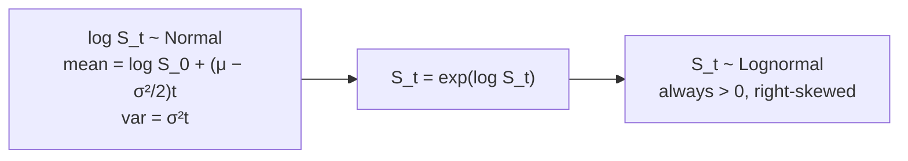

## What It Is
Geometric Brownian Motion (GBM) is the standard continuous-time model for stock prices. It describes a process where the *percentage* changes in price are normally distributed, rather than the absolute changes. The process is defined by a drift (expected return) and a volatility (randomness).

The key property: if S follows GBM, then log(S) follows ordinary Brownian Motion with drift. This means S itself is log-normally distributed — always positive, right-skewed, and multiplicative.

## Why It Matters
GBM is the foundational price model in quantitative finance. It underlies Black-Scholes option pricing and is the assumed price process in Avellaneda-Stoikov's market-making model. Understanding GBM is essential for:
- Knowing what assumptions your models bake in (constant volatility, no jumps, independent returns)
- Understanding why log-returns are used instead of arithmetic returns
- Recognizing when real markets deviate from GBM (fat tails, volatility clustering)

## Key Equations

The SDE for GBM:

$$dS = \mu S \, dt + \sigma S \, dW$$

Equivalently, in terms of returns:

$$\frac{dS}{S} = \mu \, dt + \sigma \, dW$$

The explicit solution (via [[Itô's Lemma]]):

$$S(t) = S(0) \exp\left[\left(\mu - \frac{\sigma^2}{2}\right)t + \sigma W(t)\right]$$

Note the $-\sigma^2/2$ correction — this is the Itô correction, absent in ordinary calculus.

## Simulation in Code

Sample paths from the *exact* solution (no Euler discretization error):

```python
import numpy as np

def gbm_paths(S0: float, mu: float, sigma: float,
              T: float, n_steps: int, n_paths: int, seed: int = 0) -> np.ndarray:
    rng = np.random.default_rng(seed)
    dt = T / n_steps
    Z = rng.standard_normal((n_paths, n_steps))
    increments = (mu - 0.5 * sigma**2) * dt + sigma * np.sqrt(dt) * Z
    log_S = np.log(S0) + np.cumsum(increments, axis=1)
    log_S = np.concatenate([np.full((n_paths, 1), np.log(S0)), log_S], axis=1)
    return np.exp(log_S)                              # shape: (n_paths, n_steps + 1)
```

The Itô correction is empirically visible: the *median* path drifts at $\mu - \sigma^2/2$, while the *mean* drifts at $\mu$.

```python
S = gbm_paths(S0=100, mu=0.10, sigma=0.30, T=1.0, n_steps=252, n_paths=50_000)
print(np.log(S[:, -1] / S[:, 0]).mean())              # ≈ μ − σ²/2  = 0.055
print(np.log(S[:, -1].mean() / S[0, 0]))              # ≈ μ          = 0.10
```

That gap is why "average return" and "compound growth rate" are not the same number — volatility is a tax on geometric growth.

## Lognormal Cross-Section



## Resources
- Shreve, *Stochastic Calculus for Finance II*, Chapter 4
- Avellaneda-Stoikov paper, Section 2 (assumes GBM for midprice)

## Connections
- [[Brownian Motion]] — GBM is the exponential of Brownian Motion with drift
- [[Log-Normal Distribution]] — the distribution of S(t) under GBM
- [[Itô Calculus]] — needed to solve the GBM SDE and get the σ²/2 correction
